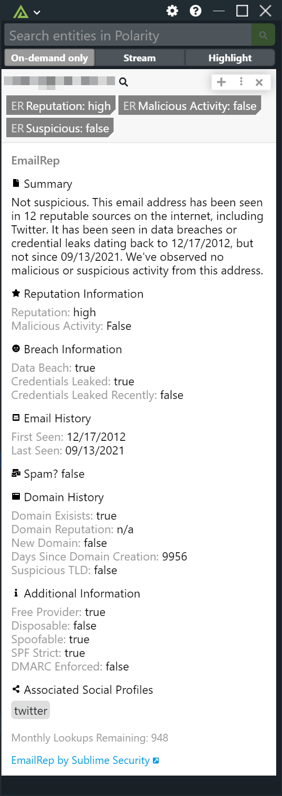

# Polarity EmailRep Integration

The Polarity - EmailRep integration queries EmailRep.io's api to let you know if an email is suspicious and has a good reputation in order to know if the email might be of malicious intent.

Here is a screenshot of the integration:

To learn more about EmailRep, please visit: [official website](https://emailrep.io)

To obtain an API Key from emailrep.io, please email hi@sublimesecurity.com.

## EmailRep Integration Options

### EmailRep ApiKey
ApiKey needed to access the EmailRep Api.

### Ignore List
List of email domains you do not want sent to EmailRep.

### Ignore Domain Regex
Regex that matches email domains that should not be sent to EmailRep.

## Installation Instructions

Installation instructions for integrations are provided on the [PolarityIO GitHub Page](https://polarityio.github.io/).

## Polarity

Polarity is a memory-augmentation platform that improves and accelerates analyst decision making.  For more information about the Polarity platform please see:

https://polarity.io/
